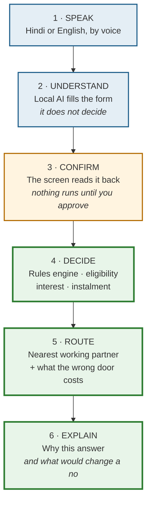
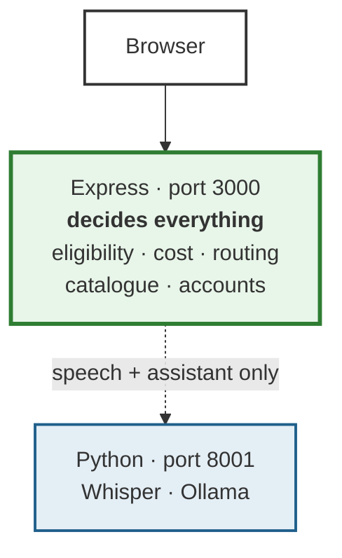

# Sahaay — Slide build sheet

Literal, element by element. Build in Canva, export **PDF**.

**Status: rewritten 8 Sept 2026**, after the Node/Express migration. The previous
version of this sheet described *SahiDwar*, a React/TypeScript frontend on a
Python/FastAPI backend, six screens, 84 tests, and a PACKET feature. Every one of
those is now wrong. What survived, and what changed, is listed in §0 so you don't
have to diff it yourself.

---

## §0 — What survived the revamp, and what didn't

**This is the section to read first.** The good news is that roughly 70% of the old
sheet was about *research*, and research doesn't go stale when you change web
frameworks. The pitch is intact. The technical claims are not.

### Survives untouched — do not rewrite these

| Element | Slide | Why it still holds |
|---|---|---|
| All six slide headings + template rules | all | SIH's mandate, unchanged |
| House style (white, #1F5F8B, 55/45 layout, source lines) | all | Still the right call |
| PS ID 26092 · Theme Miscellaneous · Category Software | 1 | Unchanged |
| The **6.5% vs 15% → ₹18,061** hero | 2 | **Re-verified live 8 Sept 2026.** See §7 |
| The myScheme / JanSamarth / PM-SURAJ comparison table | 2 | Still true; one row improves |
| MoSJE 2020 stats (61.1% · 0% · 57.2% · 89% · 15.3%) | 2, 5 | Primary source, unchanged |
| "AI understands. Rules decide." | 3 | **More** true now than before |
| Every quadrant of Feasibility & Viability | 4 | Only the stack line changes |
| Money-up-people-down chart + all impact numbers | 5 | Unchanged |
| The entire references slide | 6 | Unchanged |
| The Equinox layout lessons (comparison table, icon+pill+dotted box) | 2 | Still the best pattern |

### Must change — these are now false

| Was | Is | Where |
|---|---|---|
| **SahiDwar · सही द्वार** | **Sahaay · सहाय** | Slide 1, and everywhere |
| React · TypeScript · Vite · Tailwind | **HTML · CSS · JavaScript** (no framework, no build step) | Slide 3 |
| Python · FastAPI · SQLite (whole backend) | **Node.js · Express · EJS · SQLite**, Python retained *only* for Whisper + Ollama | Slide 3 |
| **84 automated tests** | **47 tests** — and a much better story behind them (§7) | Slide 3, Q&A |
| Six-step pipeline ending in **PACKET** | Six steps ending in **EXPLAIN**. Packet was never built, in either version | Slide 3 |
| "six screens" | **an eight-page portal** | Slides 2, 4 |
| "5 schemes" | **14 catalogue entries, 5 with full logic** | Slides 2, 4 |
| Screenshots from `evidence/phase3/screens/` | **That folder no longer exists.** Retake them (§8) | Slide 3 |
| "the map with the partner list" | **There is no map.** It is a ranked partner list with distances | Slide 3 caption |

### New material you didn't have before — use it

1. **The parity story** (§7). The engine was rewritten in a different language and
   proved identical to the rupee against the old one's own saved answers. This is a
   *better* slide-3 line than "84 tests" ever was, and it is a genuinely unusual thing
   for a hackathon team to have done.
2. **The portal surface is real now**: browse, filter, search, accounts, saved
   profiles, a grounded assistant, notification matching. The old deck promised these
   and the old build didn't have them. That gap is closed — say so.
3. **106 channel partners**, verified live, not "a partner list".
4. **"One server"** — the browser talks to exactly one address. Judges like an
   architecture you can draw in one line.

---

## Rules from the official template (not negotiable)

- **6 slides maximum, including the title slide.** So four content slides.
- Keep the section headings exactly: TITLE PAGE · IDEA TITLE / PROPOSED SOLUTION ·
  TECHNICAL APPROACH · FEASIBILITY AND VIABILITY · IMPACT AND BENEFITS ·
  RESEARCH AND REFERENCES.
- Replace the grey placeholder bullets with your content.
- Delete the last "IMPORTANT INSTRUCTIONS" slide before exporting.
- **No paragraphs.** Points, diagrams, numbers.
- Export to PDF. The portal rejects PPTX.
- SIH logo top-right, team logo top-left.

## House style — decide once, apply to all six

- Background: white.
- One accent colour: **#1F5F8B** (deep blue). Warning amber **#B26A00**, good green **#2E7D32**.
- Headings: black, bold. Sub-headings: accent blue, underlined.
- Body text: 16–18 pt minimum. If it needs to be smaller, cut words.
- Every number that matters gets a **source line under it in 9 pt grey**.
- Layout on every content slide: **text left, visual right.** Roughly 55/45.

---

# SLIDE 1 — TITLE PAGE

| Field | Value |
|---|---|
| Problem Statement ID | **26092** |
| Problem Statement Title | **AI-Driven Scheme Matching for Marginalized Entrepreneurs** |
| Theme | **Miscellaneous** |
| PS Category | **Software** |
| Team ID | *(yours from the portal)* |
| Team Name | *(exactly as registered)* |

Centred underneath:

> ## Sahaay · सहाय
> ### "The right scheme. The right office. The right answer."

Nothing else. No image.

> **Changed:** the name. Every instance of *SahiDwar* is retired. The tagline above is
> the one the live portal actually shows on its home page — use it, so the deck and the
> demo say the same words.

---

# SLIDE 2 — PROPOSED SOLUTION

Three blocks: the solution, how it addresses the problem, innovation/uniqueness.

### Heading
`PROPOSED SOLUTION` — and directly under it, in accent blue:
**Sahaay — an assistant that says: this scheme, this door, this much.**

### Left column — "What it does" — icon + coloured label pill + dotted-border description

| Icon | Label pill | Description |
|---|---|---|
| 🎤 | **SPEAK** | The applicant describes their work in Hindi, by voice. No login, no typing, no OTP. |
| 📋 | **MATCH** | Picks the right NSFDC scheme and shows the instalment, moratorium and total cost. |
| 🚪 | **ROUTE** | Finds the nearest channel partner that is *actually functioning*, from NSFDC's own published data. |
| 💬 | **EXPLAIN** | Says *why* — including exactly what would change a "no" into a "yes". |

> **Changed:** row 4 was **PACKET** ("prints a pre-filled checklist with a QR to
> PM-SURAJ"). That feature was never built, in either version of this project — the
> print button uses the browser's own print dialog. Claiming it on a slide is the kind
> of thing a judge asks you to demo. **EXPLAIN** replaces it, and it is a stronger row
> anyway: it is differentiator #1, and it is the one thing on this slide no other portal
> in India does at all.

Under the four rows, one line, smaller, no box:

> *"61.1% of NSFDC's own beneficiaries found their scheme by word of mouth — 0% from any
> digital channel. 57.2% filed at the gram panchayat. 89% never finished matriculation."*

<sub>Source: MoSJE, Evaluation Study of NSFDC, 2020 (n = 3,300)</sub>

### Right column — the innovation table

| | myScheme | JanSamarth | PM-SURAJ | **Sahaay** |
|---|---|---|---|---|
| Works by voice, in Hindi | ❌ | ❌ (text, 8 langs) | ❌ | ✅ |
| Covers NSFDC's schemes | ❌ (discovery only) | ❌ (not on it) | ✅ (apply only) | ✅ **all 14** |
| Explains *why* you were rejected | ❌ | ❌ | ❌ | ✅ |
| Routes to a partner that's *working* | ❌ | ✅ (generic lenders) | ❌ | ✅ (NSFDC data) |
| Runs fully offline | ❌ | ❌ | ❌ | ✅ |

<sub>Sources: myscheme.gov.in · jansamarth.in · pmsuraj.dosje.gov.in</sub>

> **Changed:** row 2 now says **all 14**. The old sheet just said ✅. You have a
> 14-entry catalogue live — five open with full eligibility and cost logic, five
> informational, four closed but still findable by name. Saying "14" against three
> portals that between them cover zero NSFDC schemes properly is a stronger cell than a
> bare tick.
>
> **Verified:** "Runs fully offline" was re-checked on 8 Sept 2026. The frontend makes
> **zero** external network requests — no CDN, no fonts, no map tiles, no analytics.
> The only `http://` string in the whole `web/` folder is an SVG namespace declaration,
> which is not a request. This claim is safe.

Directly under the table, one bordered callout — still the number to lead with:

> ### 6.5% vs 15%
> The same ₹1.2 lakh project costs **6.5% through the SC corporation**, **15% through an
> NBFC-MFI**. Same person, same project — different door. **₹18,061 more interest**, over
> the same three years. Nobody tells the applicant that before they queue.

<sub>Source: nsfdc.nic.in/scheme · computed on a ₹1,08,000 loan over 36 months</sub>

---

# SLIDE 3 — TECHNICAL APPROACH

**This slide needs the most work.** Almost every line of the old version described a
stack that no longer exists.

### Heading
`TECHNICAL APPROACH`

### Far left — the pipeline, as a vertical numbered flow

```
1. SPEAK          Hindi or English, by voice — no login
2. UNDERSTAND     Local AI fills in a form — it does not decide
3. CONFIRM        The screen reads it back. Nothing runs until you approve
4. DECIDE         Rules engine: eligibility, interest, instalment schedule
5. ROUTE          Nearest working partner + what the wrong door costs
6. EXPLAIN        Why this answer — and what would change a "no"
```

Stamp across the top, in red or amber: **NO INTERNET REQUIRED**

### Middle — the callout box. Most important sentence on the slide.

> ## "AI understands. Rules decide."
> The AI only turns speech into fields. Eligibility and interest come from a
> **deterministic rules table** built from NSFDC's published terms — so every
> answer is checkable against nsfdc.nic.in.
>
> **The engine was rewritten in a second language and proved identical to the rupee.
> 47 tests. 12 personas. Zero differences.**

> **Changed:** the old box claimed "84 automated tests. 12 test personas." The real
> number today is **47**, and you should not round it up. But read §7 before you feel
> bad about the smaller number — what those 47 tests *do* is far more impressive than
> what the 84 did, and it is the single best answer to "how do you know it's right?"
> you will ever have.

### Bottom strip — the stack, one line per layer

**Frontend:** HTML · CSS · JavaScript — no framework, no build step
**Backend:** Node.js · Express · EJS · SQLite
**Voice:** Whisper large-v3-turbo (runs locally)
**Understanding:** Qwen 2.5 3B via Ollama (runs locally)
**Data:** NSFDC published datasets · Standing Committee Report 25

> **Changed:** this entire block. It used to read "React · TypeScript · Vite · Tailwind"
> and "Python · FastAPI · SQLite."
>
> **Do not apologise for the plain frontend — lead with it.** "No framework, no build
> step" is a defensible engineering choice for a government access tool: every page is a
> file you can open, every line is one the team can explain under questioning, and there
> is no toolchain between the code and the browser. That is a *better* answer to "walk me
> through this file" than any React codebase would have been.
>
> The two local model names are verified live: `/meta/ai-health` reports
> `whisper: large-v3-turbo, device: cuda` and `ollama: qwen2.5:3b-instruct`.

### Right — the architecture, in one line

Draw this. It is the whole system, and it fits in four boxes:

```
Browser  ──►  Express :3000  ──►  decides everything
                   │              (eligibility · cost · routing · catalogue)
                   │
                   ▼  speech + assistant only
              Python :8001  ──►  Whisper · Ollama
```

Caption: **The browser talks to one address. The AI is an internal dependency, not a
second application.**

> **New.** You did not have this before, because before the migration the browser talked
> to a Python server on one port while pages came from somewhere else. Collapsing to one
> server is a real simplification and it draws well.

### Screenshots — retake them

Two or three, cropped, with one-word captions: *Match · Door · Explain*.

> **Changed:** the old sheet pointed at `evidence/phase3/screens/hi-S4.png` and friends.
> **That folder no longer exists in the repo.** You must retake them — see §8 for the
> exact three shots and how to get them.
>
> Also: one old caption said *"the map with the partner list"*. **There is no map.** The
> routing result is a ranked list of partner offices with distances in km. Do not put
> the word "map" on this slide; a judge who then asks to see the map has caught you.

---

# SLIDE 4 — FEASIBILITY AND VIABILITY

Four quadrants. This slide scores by being honest, not by being confident.

### Top left — Feasibility: it already runs

- **Built and working today** — an eight-page portal, end to end, on one laptop.
- **Completely offline.** No internet, no server, no account, no API cost.
- **Runs on a ₹60,000 laptop** — 6 GB graphics card, both AI models resident.
- **Real data, not mock** — 14 schemes and **106 channel partners**, from NSFDC's own published files.

> **Changed:** "six screens" → "an eight-page portal". "five schemes and 106 channel
> partners" → "14 schemes and 106 channel partners". The 106 figure is verified live.

### Top right — Challenges (name them; judges trust teams that do)

1. **Speech accuracy across accents and dialects.**
2. **Scheme terms change** — interest rates and ceilings get revised.
3. **Partner performance data is published per state, not per partner.**
4. **Adoption.** MeitY already built SBMS for this exact channel and no partner adopted it.

### Bottom left — Strategy for each

1. The transcript is **editable** and the confirm screen is **mandatory** — bad audio degrades to a half-filled form, never to a wrong answer. Production path: **Bhashini**, the government's own language stack, for all 22 languages.
2. Schemes live in a **data file, not in code**. A rate change is a one-line edit, no rebuild.
3. We say exactly what the data is — *"this state used 43.8% of its allocation"* — and **never** label a named bank. A test enforces that.
4. We are **not building a destination website.** It is built for the operator at the Common Service Centre — 5.8 lakh of them, already filing these applications.

> Unchanged, and all four still hold. Point 3's "43.8%" is live on the match page right
> now for Madhya Pradesh — if a judge asks to see it, you can.

### Bottom right — Viability

- **Zero running cost.** No cloud bill, no API keys, no per-user cost.
- **Deploys through infrastructure that already exists** — CSCs and the panchayat counter.
- **The client is already buying this.** NSFDC published a tender on **2 September 2026** for an "AI/ML Enabled Smart Data Analytical Dashboard cum Decision Support System."

---

# SLIDE 5 — IMPACT AND BENEFITS

**Unchanged from the old sheet.** Every number here is research, not architecture, and
none of it moved. Build it exactly as written.

### Left half — THE CHART: "Money up, people down"

Two lines, FY2015-16 → FY2025-26:
- NSFDC **disbursement** rising to ₹775.26 crore
- NSFDC **beneficiaries** falling to 59,002

Label only three points: the **FY18 peak (108,340)**, the **FY25 trough (41,750)**, and **FY26 (₹775.26 cr, 59,002)**.

Caption under it, bold:
> **Disbursement up 29%. People reached down 46%.**
> A record year — for fewer people than at any point in a decade.

<sub>Source: NSFDC performance data, nsfdc.nic.in, published 12 Aug 2026</sub>

### Right half — four stacked impact blocks

**Who is not being reached**
59.72 lakh SC-owned enterprises exist. NSFDC reached **59,002** last year — about **1%**, in its best year ever.
<sub>6th Economic Census · NSFDC FY2025-26</sub>

**Economic benefit, per person**
**₹18,061** saved by walking through the right door instead of the wrong one, on a single ₹1.08 lakh loan.

**Social reach**
**67% of NSFDC's borrowers are women** (39,804 of 59,002). **89%** did not finish matriculation. A voice-first Hindi interface is not a convenience for them — it is the only interface that works.

**Scalability**
India runs **six** of these corporations on an identical model — NSFDC, NSTFDC, NBCFDC, NSKFDC, NHFDC, NMDFC. Adding one is **a data file, not new code.**

---

# SLIDE 6 — RESEARCH AND REFERENCES

**Unchanged.** These are primary government sources and none of them expired.

**Scheme parameters and channel partners**
- NSFDC scheme terms — nsfdc.nic.in/scheme
- NSFDC channel partner lists (8 documents) — nsfdc.nic.in/our-channel-partners
- NSFDC performance datasets, published 12 Aug 2026 — nsfdc.nic.in/performance-data

**Government and parliamentary record**
- Standing Committee on Social Justice and Empowerment, 18th Lok Sabha, **Report 25** (Aug 2026) — 14 SCAs non-performing; Telangana and Ladakh have no SCA
- MoSJE, **Evaluation Study on the Functioning of NSFDC**, 2020 (n = 3,300)
- PIB Release 2250876 — NSFDC record FY2025-26 performance
- NSFDC tender, 2 Sept 2026 — AI/ML Decision Support System

**Population and access data**
- 6th Economic Census — SC-owned establishments
- Census 2011 — English-speaking population
- KPMG–Google, *Indian Languages: Defining India's Internet*

**Existing platforms reviewed**
- jansamarth.in · pmsuraj.dosje.gov.in · myscheme.gov.in

---

## §7 — The parity story (read before you write slide 3)

You lost 37 tests and gained a much better claim. Here is the claim, in the words to
use if a judge asks **"how do you know your numbers are right?"**:

> "The engine was originally written in Python. When we moved the project to
> Node/Express, we didn't translate it and hope. Before writing a line of JavaScript, we
> ran the Python engine across every test persona, every scheme, every channel and every
> state, and saved its exact answers to disk. The JavaScript is tested against those
> saved answers — to the rupee. 47 tests, zero differences. No rate, verdict, threshold,
> instalment, loan amount, near-miss sentence or office recommendation differs anywhere."

Then, if they push, the three things that nearly broke it — these are the details that
make the story credible rather than boastful:

1. **Rounding.** Python rounds `.5` to the nearest *even* number; JavaScript rounds up.
   `round(0.125, 2)` is `0.12` in Python, `0.13` in JavaScript. Instalments round twice
   per period, so it drifts. One module exists solely to reproduce Python's behaviour,
   checked against 413 values generated by Python itself.
2. **Floating-point grouping.** `a * b / 100 * c / 12` and `a * b / 100 / 12 * c` give
   different last digits. The arithmetic is grouped exactly as the Python was.
3. **Hindi text encoding.** Some Devanagari characters have two byte encodings that look
   identical but compare unequal. Retyped Hindi strings silently failed comparison; every
   one is now copied from the original source.

**Why this beats "84 tests":** anyone can write 84 tests that assert what their own code
already does. Almost nobody has an independent second implementation to check against.
You do — and you can name the three bugs it caught.

Verified 8 Sept 2026: `cd server && npm test` → **47 pass, 0 fail**, in about 2 seconds.

---

## §8 — The screenshots: retake these three

`evidence/phase3/screens/` is gone. Take fresh ones. Start both processes (see
`PROJECT-GUIDE.md` §1), sign in as `sunita / demo123`, keep the language on **हिं**.

| # | Where | What must be in frame | Caption |
|---|---|---|---|
| 1 | `/match.html`, top | The green card: *आपकी योजना: सूक्ष्म वित्त योजना* and **6.5% — सबसे कम दर जिसके आप पात्र हैं** | **Match** |
| 2 | `/match.html`, scroll to the amber near-miss | *मियादी ऋण ₹1,40,001 से शुरू होती है। आपका काम ₹1,20,000 का है।* | **Explain** |
| 3 | `/match.html`, scroll to routing | The **₹18,061** headline + the partner list with *43.8% आवंटन* warning | **Door** |

Shots 2 and 3 are the two differentiators no other portal has. If you only have room
for two screenshots, drop shot 1.

**How:** browser at 110% zoom, window 1280×720 or larger, crop the browser chrome out.
Do not use a phone camera on the screen.

---

## The visuals, and how to make each one

| # | Visual | Slide | How |
|---|---|---|---|
| 1 | The 6-step pipeline flow | 3 | **Mermaid** — source below |
| 2 | The one-line architecture | 3 | **Mermaid** — source below. New this revision |
| 3 | Money-up-people-down chart | 5 | **Ask me** — I'll generate it from the CSV as a PNG. Don't hand-draw it |
| 4 | Screenshots | 3 | **Retake.** See §8 |
| 5 | 6.5% vs 15% hero | 2 | **Plain Canva text.** Two huge numbers |
| 6 | Four-quadrant layout | 4 | Canva shapes. Four rounded rectangles |

### Mermaid — the pipeline (slide 3)

Paste into **mermaid.live**, export PNG or SVG.



### Mermaid — the architecture (slide 3, new)



---

# Before you export

- [ ] Exactly 6 slides. Instructions slide deleted.
- [ ] **Zero occurrences of "SahiDwar"** anywhere in the deck.
- [ ] **Zero occurrences of "React", "TypeScript", "Tailwind", "FastAPI"** anywhere.
- [ ] The test count reads **47**, not 84.
- [ ] The word **"packet"** does not appear as a built feature.
- [ ] The word **"map"** does not appear on slide 3.
- [ ] Screenshots are freshly taken (§8), not from `evidence/phase3/`.
- [ ] Every statistic has its source in small grey text.
- [ ] No paragraph longer than two lines.
- [ ] Team name and Team ID filled on slide 1.
- [ ] Exported as **PDF**, under 10 MB.
- [ ] Read it once at 50% zoom — if a number isn't readable, it's too small.
